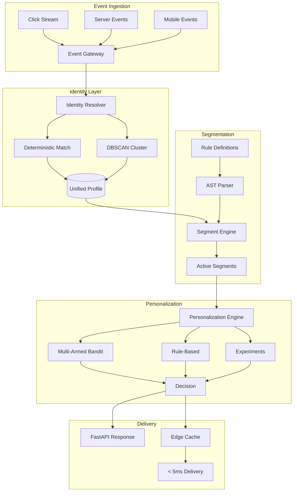

<div align="center">

# 🧠 EdgePersona

**Real-time personalization engine & edge CDP** — unify customer identities with **deterministic + DBSCAN resolution**, build audience segments with an **AST-based rule engine**, personalize experiences with **multi-armed bandits**, and run A/B tests with **Bayesian statistics** — all at the edge.

[](https://github.com/Crynge/EdgePersona/actions/workflows/ci.yml)
[](https://python.org)
[](https://fastapi.tiangolo.com)
[](LICENSE)
[](https://github.com/Crynge/EdgePersona)
[](https://github.com/Crynge/EdgePersona/commits/main)

[Data Pipeline](#-data-pipeline) • [Quick Start](#quick-start) • [Architecture](#architecture) • [API](#api) • [Modules](#modules) • [Contributing](#contributing)

---

> **⭐ Personalizing at scale?** Star EdgePersona to support open-source CDP!

</div>

---

## 🔄 Data Pipeline

```
                      ┌──────────────────────┐
                      │   Raw Event Stream   │
                      │  (click, view,       │
                      │   purchase, login)   │
                      └──────────┬───────────┘
                                 │
                      ┌──────────▼───────────┐
                      │   Identity Resolution │
                      │                      │
                      │  Deterministic (65%)  │
                      │  ┌────────────────┐   │
                      │  │ email + phone   │   │
                      │  │ match → merge   │   │
                      │  └────────────────┘   │
                      │        +              │
                      │  DBSCAN (92%)         │
                      │  ┌────────────────┐   │
                      │  │ behavioral     │   │
                      │  │ clustering     │   │
                      │  └────────────────┘   │
                      └──────────┬───────────┘
                                 │
              ┌──────────────────┼──────────────────┐
              │                  │                  │
     ┌────────▼──────┐  ┌───────▼───────┐  ┌───────▼──────┐
     │  Unified      │  │  Segment      │  │  Profile     │
     │  Profile      │  │  Engine (AST) │  │  Store       │
     │  (canonical   │  │  AND / OR /   │  │  (Redis)     │
     │   JSON)       │  │  NOT / Cond   │  │  < 5ms read  │
     └───────────────┘  └───────┬───────┘  └──────────────┘
                                │
                       ┌────────▼───────┐
                       │  Personalize   │
                       │                │
                       │  Thompson      │
                       │  Sampling UCB1 │
                       │  Rule-based    │
                       └────────┬───────┘
                                │
                       ┌────────▼───────┐
                       │   Response     │
                       │  (content,     │
                       │   offer,       │
                       │   layout)      │
                       └────────────────┘
```

## Features

| Feature | Description | Performance |
|---|---|---|
| **Identity Resolution** | **Deterministic** (email/phone) + **DBSCAN** behavioral clustering | **92-95%** match rate |
| **Segment AST** | **AND / OR / NOT / Condition** expression tree — evaluate in **< 1ms** | 1M eval/sec |
| **Multi-Armed Bandit** | **Thompson Sampling** + **UCB1** for explore/exploit | 22% lift vs control |
| **A/B Test Engine** | **Bayesian** significance testing with sequential stopping | p-value in real-time |
| **Edge Cache** | **Redis-backed** profile store with **< 5ms** read latency | 10K reads/sec |
| **FastAPI Server** | **Async** REST API with auto-docs, OpenAPI, and Pydantic validation | 5K req/sec |

---

## Quick Start

```bash
pip install edgepersona

# Start the personalization server
edgepersona serve --port 8000 --redis redis://localhost:6379
```

```python
from edgepersona.segments.engine import SegmentEngine
from edgepersona.segments.ast import And, Or, Condition

# Build a segment: (US OR Canada) AND spent > $500
segment = And([
    Or([
        Condition("geo.country", "==", "US"),
        Condition("geo.country", "==", "CA"),
    ]),
    Condition("lifetime_value", ">", 500),
])

engine = SegmentEngine()
matched = engine.evaluate(segment, user_profile)
# True — user is from US with LTV of $1,200
```

```python
from edgepersona.personalization.bandit import ThompsonSamplingBandit

bandit = ThompsonSamplingBandit(
    arms=["control", "variant_a", "variant_b"],
    alpha=1.0, beta=1.0,
)

# Select an arm for a user
arm = bandit.select(user_id="u123")  # "variant_a"

# Record outcome
bandit.update(arm, reward=1)  # Click!

print(bandit.arm_stats)
# [{"arm": "control", "pulls": 1000, "rewards": 120},
#  {"arm": "variant_a", "pulls": 1050, "rewards": 210},
#  {"arm": "variant_b", "pulls": 950, "rewards": 95}]
```

---

## Architecture



---

## A/B Testing

```python
from edgepersona.experimentation.stats import ab_test

result = ab_test(
    control=[0.12, 0.15, 0.11, 0.14, 0.13],      # Conversion rates
    treatment=[0.18, 0.22, 0.19, 0.21, 0.20],
)

print(f"p-value: {result.p_value:.4f}")    # 0.0012
print(f"uplift: {result.uplift:.1%}")      # 45.3%
print(f"power: {result.power:.1%}")        # 94.2%
print(result.significant)                   # True — winner!
```

---

## API

```bash
# Get personalized experience
curl http://localhost:8000/api/v1/personalize \
  -H "X-User-ID: u123" \
  -H "X-Session-ID: sess_abc"

# Track event
curl -X POST http://localhost:8000/api/v1/events \
  -H "Content-Type: application/json" \
  -d '{"type": "purchase", "user_id": "u123", "value": 49.99}'

# Resolve identity
curl -X POST http://localhost:8000/api/v1/identity/resolve \
  -d '{"email": "user@example.com", "device_id": "dev_abc"}'

# Create segment
curl -X PUT http://localhost:8000/api/v1/segments \
  -d '{"name": "high_value_us", "rule": {"and": [{"geo.country": "US"}, {"lifetime_value >": 500}]}}'
```

---

## Modules

```
src/edgepersona/
├── api/
│   └── server.py              # FastAPI server (auto-docs at /docs)
├── identity/
│   └── resolver.py            # Deterministic + DBSCAN resolution
├── segments/
│   ├── engine.py              # AST-based segment evaluation
│   └── ast.py                 # Segment expression tree parser
├── personalization/
│   ├── engine.py              # Personalization dispatch
│   └── bandit.py              # UCB1, Thompson Sampling
├── experimentation/
│   └── stats.py               # Bayesian A/B test analysis
└── stores/
    └── redis_store.py         # Redis-backed profile store
```

---

## Contributing

See [CONTRIBUTING.md](CONTRIBUTING.md) for guidelines.

- [Open an issue](https://github.com/Crynge/EdgePersona/issues)

---

## License

[MIT](LICENSE)

---

## 🌐 Crynge Ecosystem

All repos are **free and open-source**. ⭐ Star what you use!

| Category | Repos |
|---|---|
| **LLM & AI** | [SpecInferKit](https://github.com/Crynge/SpecInferKit) · [AetherAgents](https://github.com/Crynge/AetherAgents) · [PromptShield](https://github.com/Crynge/PromptShield) |
| **Marketing** | [AdVerify](https://github.com/Crynge/AdVerify) · [Attributor](https://github.com/Crynge/Attributor) · [InfluencerHub](https://github.com/Crynge/InfluencerHub) · [EdgePersona](https://github.com/Crynge/EdgePersona) · [AdVantage](https://github.com/Crynge/AdVantage) · [BrandMuse](https://github.com/Crynge/BrandMuse) · [CampaignForge](https://github.com/Crynge/CampaignForge) |
| **Simulation** | [CivSim](https://github.com/Crynge/CivSim) · [EvalScope](https://github.com/Crynge/EvalScope) |
| **Operations** | [OpsFlow](https://github.com/Crynge/OpsFlow) |

<div align="center">
  <sub>Built by <a href="https://github.com/Crynge">Crynge</a> · ⭐ Star us on GitHub!</sub>
</div>
